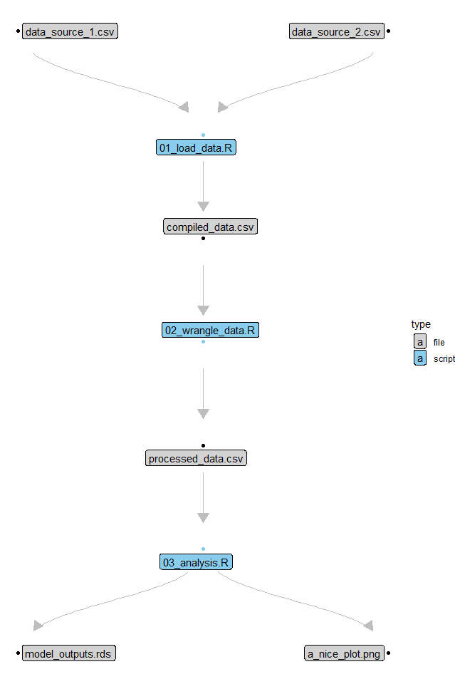

# pipelinemapper
Thomas Keggin
1 Apr, 2025

<!-- badges: start -->

[](https://github.com/thomaskeggin/pipelinemapper/actions/workflows/R-CMD-check.yaml)
[](https://app.codecov.io/gh/thomaskeggin/pipelinemapper)
<!-- badges: end -->

Welcome to the pipelinemapper mini-package.

pipelinemapper is a lightweight tool that allows users to tag input and
output path strings in any code scripts (not limited to R) to produce a
graph, or flowchart, of how objects are passed through scripts in a
pipeline.

For me, this has been most useful in making sure each script is actually
importing and exporting the files that I intend them to whilst
prototyping and building pipelines. If you are looking for a broader
pipeline or project management tool, then perhaps something like
[Snakemake](https://snakemake.readthedocs.io/en/stable/) would be a
better fit for you.

### Installation

You can install the development version of pipelinemapper directly from
the GitHub repository.

``` r
# install.packages("devtools")
devtools::install_github("thomaskeggin/pipelinemapper")
```

### Usage

#### Inline tags

The package is built entirely around the premise of inline path tagging
of input and output paths. If you don’t tag your scripts, then paths
won’t be detected. There are two basic limitations:

1.  **Only one path per line.**
2.  **Paths must be a single string, i.e. not a composite, or pasted
    string (see below).**

The inline tags can be whatever you want, although I find that the
default `#input` and `#output` tags are intuitive and easy to implement.

It is important that tags are consistent across scripts.

✅ Using the default tags, a script within a pipeline could look
something like this.

``` r
# load in raw data
raw_data <-
  read.csv("data/raw_data.csv") #input

# process raw data (convert to matrix)
processed_data <-
  as.matrix(raw_data)

# write processed data
saveRDS("processed_data/matrix_data.rds") #output
```

❌ Whilst something like this composite, or pasted, path would throw an
error.

``` r
input_path_1 <-
  paste0("./external/",string_variable,".csv") #input
```

✅ If your script is looped or run in parallel to load in many files
within a single directory, then you can tag that container directory
instead of each file individually.

``` r
# define the input directory
input_directory <-
  "path/to/inputs/" #input

# list the files within the input directory
input_files <-
  list.files(input_directory)

# create a list container to load the files into
object_container <-
  vector(mode = "list", length = length(input_files))

# loop through each file to load them into a list container
for(file in 1:length(input_files)){
  
  object_container[[file]] <-
    readRDS(paste0(input_directory,file))
}
```

#### Mapping and visualisation

Once you have tagged your pipeline scripts, then mapping and visualising
your data flow is straightforward. The package only contains 4
functions: the core `mapScript()` function, and the three wrapper
functions which run in order.

- `mapScipt()` generates an input/output data frame for a single script.

1.  `mapPipeline()` loops `mapScript()`through all files with target
    extensions in a particular directory - returning a compiled
    input/output data frame for those scripts.

2.  `graphPipeline()` uses the [igraph](https://r.igraph.org/) package
    to convert the input/output data frame into an igraph object.

3.  `plotPipeline()` generates a flowchart from the igraph object to
    visualise the pipeline using the
    [ggraph](https://ggraph.data-imaginist.com/) and
    [ggplot2](https://ggplot2.tidyverse.org/) packages. I hope this is
    useful, but if you prefer, the default `igraph::plot.igraph()` (or
    any other graph plotting method) also works.

Implementation can be as simple as this:

``` r
# define your pipeline directory containing your scripts.
pipeline_directory <-
  system.file("dummy_pipeline",
              package = "pipelinemapper")

# apply mapScript() to all target files in the pipeline directory.
pipelinemapper::mapPipeline(pipeline_directory_path =  pipeline_directory,
                            file_extensions = c(".r",".rmd",".qmd"),
                            input_tag = "#input",
                            output_tag = "#output") |> 
  
  # pass the pipeline input/output data frame to graphPipeline()
  pipelinemapper::graphPipeline() |> 
  
  # visualise the resultant igraph object
  pipelinemapper::plotPipeline(show_full_paths = FALSE)
```



#### Note

If your pipeline is split across multiple container directories, it is
possible to apply `mapPipeline()` to each directory, bind the resultant
pipeline data frames, then convert to a single graph with
`graphPipeline()`.

``` r
# map each directory
pipeline_dataframe_1 <-
  pipelinemapper::mapPipeline("pipelines/pipeline_1")

pipeline_dataframe_2 <-
  pipelinemapper::mapPipeline("pipelines/pipeline_2")

# bind pipeline data frames together
composite_pipeline_dataframe <-
  rbind.data.frame(pipeline_dataframe_1,
                   pipeline_dataframe_2)

# convert to pipeline graph
composite_pipeline_graph <-
  pipelinemapper::graphPipeline(composite_pipeline_dataframe)
```
